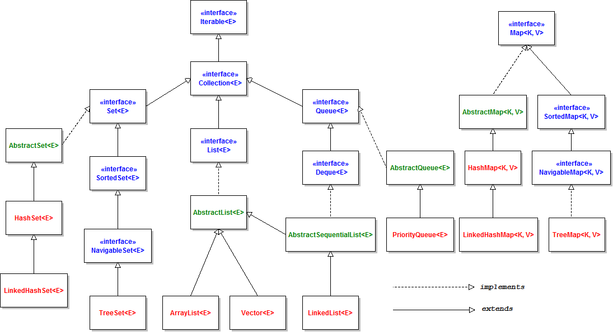

```
### 질문) 

<details>
    <summary>답변</summary>

- 

</details>
```


### 질문) Java의 실행과정에 대해 설명해주세요

<details>
    <summary>답변</summary>

1. 소스파일 작성 (.java)
2. 자바 컴파일러(javac.exe)로 소스파일을 컴파일하여 바이트코드(.class) 파일 생성
3. JVM 구동 명령어(java.exe)로 바이트코드를 운영체제에 맞게 기계어로 번역

</details>

#### 꼬리질문1) 인터프리터와 컴파일러의 특징을 비교하며 설명해주세요

<details>
    <summary>답변</summary>

인터프리터
- 고급언어를 미리 컴파일 하지 않고, 프로그램 실행 시점에 번역과 실행

컴파일러
- 작성한 코드를 직접 기계어로 변환
- 

</details>


#### 꼬리질문2) Java는 어떤 실행 방식을 채택하고 있나요?

<details>
    <summary>답변</summary>

- 정적 컴파일러와 Jit 컴파일러를 모두 사용하고 있다.
- 소스코드 &rarr; 바이트코드 : 자바 정적 컴파일러
- 바이트코드 &rarr; 기계코드 : JVM Jit 컴파일러

</details>

---
</br>

### 질문) JVM 이란 무엇이며 구성요소는 어떻게 되는지 설명해주세요

<details>
    <summary>답변</summary>

- 

</details>

#### 꼬리질문1) JVM은 메모리 관리를 어떻게 수행하나요?

<details>
    <summary>답변</summary>

- Grabage Collection 을 통해 메모리 관리를 수행한다.
- 

</details>

#### 꼬리질문) 기업에서는 왜 Java를 사용할까요? 면접자의 의견이 궁금합니다.

<details>
    <summary>답변</summary>

- 
</details>


---
</br>

### 질문) JDK에 대해서 설명해주세요.

<details>
    <summary>답변</summary>

- JDK는 Java Development Kit의 약자
- 현재의 자바 표준 버전은 Java SE(standard edition)이지만, 일반적으로 JDK라고 불린다.
- Oracle이 Sun 사를 인수하며, Java SE 11 부터 유료화 되었다. Oracle에서 제공하는 OpenJDK는 오픈소스 버전의 JDK 이다.

</details>

#### 꼬리질문1) JDK와 JRE의 차이점에 대해 설명해주세요.

<details>
    <summary>답변</summary>

- JRE는 실행만을 위한 환경.
- JRE만 설치할 경우 컴파일러 등이 제외 됨.
- JDK는 개발에 필요한 JVM, ~~라이브러리 API~~, javac(컴파일러), ~~jheap, jconsole~~ 등이 포함된다.
    - 확인필요
- Java9 버전 부터 JDK 안에 JRE를 포함하고 있으며, JDK만 배포되고 있다.

</details>

#### 꼬리질문2) GraalVM JDK 

<details>
    <summary>답변</summary>
    
- 출처 : https://www.oracle.com/java/graalvm/what-is-graalvm/
</details>

#### 꼬리질문3) JDK 1.5, 1.7, 1.8 은 다른 버전 업데이트에 비해 많은 변화가 일어났습니다. 버전별 주요 특징을 아는만큼 설명해주세요.

<details>
    <summary>답변</summary>
    
- 
</details>

---
</br>

### 질문) 제네릭에 대해 설명해주세요.

<details>
    <summary>답변</summary>

- 명시적으로 타입을 지정하기 위해 사용된다.
- 형 변환에서 발생할 수 있는 불편함을 보완하기 위해 Java5 버전에서 추가된 기능.
    - 런타임 시점에 잘못된 형 변환으로 인해 예외 발생을 방지.
    ```java
    dto1.setObject(new String());
    dto2.setObject(new StringBuffer());
    dto3.setObject(new StringBuilder());

    String temp1 = (String)dto1.getObject();
    StringBuffer temp2 = (StringBuffer)dto2.getObject();
    String temp3 = (String)dto3.getObject(); // 잘못된 형 변환
    ```

    - 의도하는 타입으로 반환받기 위해 instaceof 연산자를 사용하는 과정이 없어 코드의 간결성 향상
    ```java
    // 타입 점검을 위한 추가적인 코드
    if(tempObject instanceof String){
        ...
    }else if(tempObject instanceof StringBuffer){
        ...
    }
    ```

</details>

#### 꼬리질문) Java의 Covariant(공변성)에 대해 알고 계신가요? 공변성이란, ~ 를 의미합니다. 제네릭은 이를 지원하지 않습니다. 지원하지 않는 이유, 이로 인해 발생하는 문제, Java의 해결방안에 대해서 설명해주세요.

<details>
    <summary>답변</summary>

- 출처 : https://inpa.tistory.com/entry/JAVA-%E2%98%95-%EC%A0%9C%EB%84%A4%EB%A6%AD-%EC%99%80%EC%9D%BC%EB%93%9C-%EC%B9%B4%EB%93%9C-extends-super-T-%EC%99%84%EB%B2%BD-%EC%9D%B4%ED%95%B4

</details>

#### 꼬리질문) 제네릭의 와이들카드 종류와 각 특징에 대해 설명해주세요.

<details>
    <summary>답변</summary>

- 

</details>

---
</br>

### 질문) Java의 Collection에 대해서 설명해주세요

<details>
    <summary>답변</summary>

- 컬렉션은 목록성 데이터를 처리하는 자료구조를 통칭.
- 자바의 자료구조는 Map과 Collection 인터페이스를 구현.


</details>

#### 꼬리질문) 어떻게 Collection 인터페이스를 구현한 모든 클래스는 for-each 구문을 사용할 수 있을까요?

<details>
    <summary>답변</summary>

- 컴파일러가 for-loop 구문을 아래와 같이 변환한다.
- Collection 인터페이스는 Iterable 인터페이스를 구현하기 때문.
- Iterable 인터페이스를 구현한 클래스는 for-loop 구문을 사용할 수 있다.
- Iterable 인터페이스에는 Iterator<T> iterator(); 메소드가 정의되어 있는데, Iterator 를 반환하고, Iterator 에는 hasNext()와 next() 메소드가 정의되어 있다.

</details>

#### 꼬리질문1) Vector와 ArrayList는 모두 AbstractList 추상클래스를 구현하는 클래스 이지만, 대게 ArrayList를 많이 사용합니다. 어떤 이유 때문일까요?


<details>
    <summary>답변</summary>

- thread safe
    - Unlike the new collection implementations, Vector is synchronized. If a thread-safe implementation is not needed, it is recommended to use ArrayList in place of Vector.(출처 : https://docs.oracle.com/javase/7/docs/api/java/util/Vector.html)
- 내부 동작 차이
    - 새 요소를 추가할 때, 여유공간이 없으면 vector는 사이즈의 2배 / arraylist는 1/2배 증가

</details>

#### 꼬리질문3) Collection 객체를 복사할 때, deep copy 를 수행하기 위한 방법에 대해 설명해주세요. 

- addAll() 메소드


---
</br>

### 질문) Map, Set을 비교하여 각 특징을 설명해주세요

<details>
    <summary>답변</summary>

- 공통점 : Java의 자료구조, 제네릭을 사용해 데이터타입을 명시
- 차이점 : 패키기 구조, 동작 방식, 사용법

**Set**
- 

**Map**
- key-value 형식으로 값을 저장.
- 메소드 : get(), put()

</details>

### 꼬리질문)

- HashMap 의 시간 복잡도
- 항상 O(1) 인가요?
- 해시 충돌에 대해서 아시나요?
- 그렇다면 그걸 자바에서는 해시 충돌에 대해 어떻게 대응하나요?
- TreeBin 방식은 어떨 때 사용하나요?
- HashMap 이외에 다른 Map 종류들을 알고 계신게 있으신가요?
- HashMap은 key를 어떠한 형태로 저장하나요?
- HashMap의 key에는 기본자료형과 참조자료형이 모두 가능합니다. 만약 특정 객체를 key로 설정한다면 주의해야 할 점은 무엇일까요?
- 순서를 보장하지 않는 다는 것을 무엇을 의미하는가? 조금 더 자세하게 설명
    - 자료구조에 저장되는 데이터의 순서가, 입력 순서와 일치하지 않을 수 있음을 의미.
    - 정렬되지 않음을 의미하는 것이 아님.
    - 출처 : https://stackoverflow.com/questions/31471982/why-hashset-order-always-same-for-my-program

---
</br>

### 질문) 프로세스와 스레드에 대해 설명해주세요

<details>
    <summary>답변</summary>

Proccess : 실행 중인 프로그램
Thread : 프로세스 내부에서 실행되는 하나의 실행 단위
- 하나의 프로세스가 시작되면, 최소 하나 이상의 쓰레드가 수행된다.
- Java는 쓰레드를 생성하지 않아도, JVM 관리를 위한 여러 쓰레드가 수행된다. E.g. GC 쓰레드
- 쓰레드를 추가하는 것은 물리적 메모리 자원을 소비하지만, 병렬 처리가 가능해진다.
- 같은 프로세스 안에 있는 여러 스레드들은 같은 힙 공간을 공유

</details>

#### 꼬리질문) 자바에서 쓰레드를 생성하는 방법은 두 가지가 있습니다. 각 방법의 특징과 차이점에 대해 말씀해주세요.

<details>
    <summary>답변</summary>

- Runnable 인터페이스를 구현하는 방법
    - run() 메소드를 구현하는 클래스가 다른 클래스를 상속해야 할 때. 그렇지 않은 경우 Thread 클래스를 상속하는 것이 더 편리.
- Thread 클래스를 상속하는 방법


</details>

#### 꼬리질문) run() 메소드와 start() 메소드의 역할은 무엇인가요?

<details>
    <summary>답변</summary>

- run() : 쓰레드가 수행하는 코드를 작성
- start() : 쓰레드를 시작하는 메소드

</details>

#### 꼬리질문) 데몬쓰레드와 사용자쓰레드의 차이점은 무엇인가요?

<details>
    <summary>답변</summary>

- 사용자 쓰레드 : JVM이 해당 쓰레드가 끝날 때 까지 대기
- 데몬 쓰레드 : 해당 데몬 쓰레드의 종료 여부와 관계없이, JVM 종료시 해당 쓰레드도 종료.
    - 단, 데몬 쓰레드 시작 전 데몬 쓰레드로 지정해야 한다.
    - 모니터링과 같은 부가작업을 수행할 때 사용

</details>

#### 꼬리질문) 쓰레드로부터 안전하다는 것은 무엇을 의미하며, 어떻게 해야 안전할까요?

<details>
    <summary>답변</summary>

- 여러 쓰레드가 동일한 객체의 인스턴스 변수를 사용/수정할 경우 의도한 것과 다른 값이 될 수 있다.
- 이러한 문제를 해결하기 위해 `synchronized` 를 사용해 한 번에 하나의 쓰레드가 접근하도록 한다.

1. 메소드에 `synchronized` 키워드
2. `synchronized` 블록
    - 파라미터에 객체를 주입하여, 잠금처리에 사용한다.
    - 특정 쓰레드가 A 객체로 잠금된 `synchronized` 블록을 사용중이라면, 동일한 A 객체로 잠금된 다른 `synchronized` 블록에 접근하지 못한다.
    - 참고 링크 : https://stackoverflow.com/questions/29876641/what-is-the-purpose-of-passing-parameter-to-synchronized-block
</details>

---
</br>

### 질문) Java8에 추가된 Optional에 대해 설명해주세요

<details>
    <summary>답변</summary>

- 객체를 편리하게 처리하기 위해 도입
- final로 선언되어 상속 불가
- 

</details>

#### 꼬리질문1) Optional 에는 orElse() 메소드와 orElseGet() 메소드가 있습니다. 두 메소드의 차이는 무엇일까요?

<details>
    <summary>답변</summary>

- Optional 안의 값이 없는 경우, 기본값을 지정할 수 있음.
- orElseGet()은 `Supplier<T>` 인터페이스를 매개받음. 람다표현식 사용 가능.

</details>


---
</br>


### 질문) Java8에 추가된 Lambda에 대해 설명해주세요

<details>
    <summary>답변</summary>

- 익명클래스의 가독성을 보완하기 위해 등장.
- 인터페이스에 메소드가 오직 하나만 존재하는 함수형 인터페이스를 

</details>

#### 꼬리질문) 익명클래스는 람다표현식으로 전환이 가능합니다. 그렇다면 컴파일 된 바이트코드 상 차이점은 있을까요?

<details>
    <summary>답변</summary>

- 참고 링크 : https://alkhwa-113.tistory.com/entry/%EB%9E%8C%EB%8B%A4%EC%8B%9Dfeat-%EC%9D%B5%EB%AA%85-%EA%B5%AC%ED%98%84-%ED%81%B4%EB%9E%98%EC%8A%A4-vs-%EB%9E%8C%EB%8B%A4%EC%8B%9D

</details>

#### 꼬리질문) Java가 제공하는 기본 함수형 인터페이스에는 어떤것들이 있나요?

<details>
    <summary>답변</summary>

- Predicate : 두 객체를 비교할 때 사용, boolean 값 반환
- Supplier : 제네릭으로 선언된 타입을 반환
- Consumer : 매개변수를 받을 수 있으며, 작업을 수행 후 반환하지 않음
- Function : 제네릭 T, R 으로 T 매개 타입, R 반환 타입

</details>

---
</br>

### 질문) Java8에 추가된 Stream에 대해 설명해주세요

<details>
    <summary>답변</summary>

- 많은 양의 데이터를 효율적으로 처리하기 위함
- 스트림의 구조는 스트림 생성, 중개 연산, 종단 연산
- 중개 연산은 0개 이상, 대표적으로 filter(), map()
- 종단 연산은 대표적으로 collect(), forEach()

</details>

---
</br>

### 질문) I/O 란 무엇인가요?

<details>
    <summary>답변</summary>

- Input, Output 입출력을 통칭하는 용어로 JVM을 기준으로 읽는 작업에 InputStream, 쓰는 작업에 OutputStream을 통해 동작한다.
- Java1.4 부터 NIO 가 추가됨. 스트림 기반이 아닌, 버퍼와 채널 기반으로 데이터 처리.

</details>

#### 꼬리질문) FileInputStream 클래스를 사용해 파일의 데이터를 읽는 방법을 설명해주세요. 

- 생성자에 파일 이름을 명시하고, read() 메소드를 통해 byte 단위로 파일을 읽어야 하기에 비효율적이다. 대부분의 파일은 텍스트기반이기 때문에 Reader 클래스를 확장한 클래스 중 `BufferedReader`, `InputStreamReader`를 대게 사용한다.
- `자바의 신 vol 2 - 3rd`204 쪽 설명과 달리 protected 생성자가 아닌 public 이다.
- 반드시 예외처리를 해주어야 하며, 자원을 close() 해주어야 한다.

#### 꼬리질문) FileWriter와 BufferedWriter 차이

FileWriter
- 호출마다 파일에 쓰기

BufferedWriter
- 버퍼 공간에 데이터 보관, 버퍼가 차면 데이터 저장
- BufferedWriter 생성자에 Writer 객체를 주입받아 객체 생성.
- 두 번째 인자에 버퍼의 크기를 지정할 수 있음