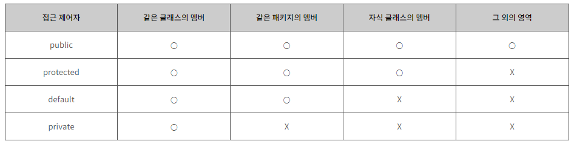

Sample Format
```
### Depth 1 Question
<details>
    <summary>Answer 1</summary>

- contents

</details>

#### Tail Question) Depth 2 Question
<details>
    <summary>Answer of Depth 2</summary>

- contents

</details>
```

### 질문) 메소드의 제어자에 대해 설명해주세요.

<details>
    <summary>답변</summary>

- 메소드의 특성을 정하는 부분
- 접근 제어자와 static 키워드

</details>

#### 꼬리질문1) 접근제어자의 종류와 특징에 대해 설명해주세요.

<details>
    <summary>답변</summary>

- 접근제어자는 클래스, 메소드, 인스턴스 변수, 클래스 변수에 적용할 수 있다.
- public : 어디에서나 접근 가능
- protected : 동일 패키지 또는 상속관계인 경우 접근 가능
- default : 아무런 접근 제어자를 적어주지 않은 경우, package-private으로 동일 패키지에서 접근 가능
- private : 동일 클래스 내에서만 접근 가능


</details>

#### 꼬리질문2) 접근제어자는 왜 필요한가요?

<details>
    <summary>답변</summary>

- 메소드를 마음대로 호출하면 안 될 경우, 접근제어자로 통제하여 조회, 수정 등을 못하게 한다.

**Tips on Choosing an Access Level:**

If other programmers use your class, you want to ensure that errors from misuse cannot happen. Access levels can help you do this.

- Use the most restrictive access level that makes sense for a particular member. Use private unless you have a good reason not to.
- Avoid public fields except for constants. (Many of the examples in the tutorial use public fields. This may help to illustrate some points concisely, but is not recommended for production code.) Public fields tend to link you to a particular implementation and limit your flexibility in changing your code.
- 참고 링크 : [공식 문서](https://docs.oracle.com/javase/tutorial/java/javaOO/accesscontrol.html)

</details>

#### 꼬리질문3) 접근제어자를 클래스에 적용할 때 유의해야할 점은 무엇인가요?

<details>
    <summary>답변</summary>

1. 클래스 내부에 선언된 접근제어자를 포함하는 범위의 접근제어자를 선언해야 한다.
2. .java 소스파일 내에 여러 클래스를 선언하는 경우, public 접근 제어자를 가진 클래스는 오직 하나이다. 즉, 서로 다른 이름을 가진 클래스가 모두 public 접근제어자를 가져서는 안된다.

</details>

#### 꼬리질문4) 테스트 코드를 작성할 때 접근제어자는 생략하는 경우가 일반적입니다. 왜 생략해도 무방할까요?

<details>
    <summary>답변</summary>

- 내용

</details>

---
</br>

### 질문) Java의 실행 과정에 대해 설명해주세요

<details>
    <summary>답변</summary>

- contents

</details>

---
</br>

### 질문) 변수의 종류에 대해 설명해주세요

<details>
    <summary>답변</summary>

- 지역 변수
- 매개 변수
- 인스턴스 변수
- 클래스 변수

</details>

---
</br>

### 질문) Java 기본 자료형의 종류는 무엇이 있나요?

<details>
    <summary>답변</summary>

- 정수형 : byte, short, int, long (aka. bsil)
- 실수형 : float, double (aka. fd)
- 그 외 : boolean


</details>

#### 꼬리질문1) byte 자료형은 왜 -128~127 범위를 가지는지 아시나요?

<details>
    <summary>답변</summary>

- 1byte 는 8bit
- 컴퓨터의 최소 단위 bit는 0, 1 2진수 값을 저장 가능
- 그런데, 자바의 정수형 기본 자료형은 모두 signed 타입
- 가장 첫 번째 비트는 부호를 나타내는 비트.
- 따라서 1000_0000 ~ 0111_111 &rarr; -128~127

</details>

#### 꼬리질문2) 그럼 Java에는 unsigned 타입의 자료형에는 무엇이 있나요?

<details>
    <summary>답변</summary>

- char
- 참고 링크 : [is-java-char-signed-or-unsigned-for-arithmetic](https://stackoverflow.com/questions/54924058/is-java-char-signed-or-unsigned-for-arithmetic)

</details>

#### 꼬리질문3) float 이나 double 자료형은 돈을 위한 값을 저장하기에는 부적절해요. 왜 부적절하고 대안은 무엇이 있을까요?

<details>
    <summary>답변</summary>

- BigDecimal
- 참고 링크 : [@new_wisdom/Java-BigDecimal](https://velog.io/@new_wisdom/Java-BigDecimal과-함께하는-아마찌의-너드짓)

</details>

#### 꼬리질문4) new 연산자로 객체를 생성하는 것과 valueOf()메소드로 객체를 생성하는 방법의 차이점이 있을까요?

<details>
    <summary>답변</summary>

- contents

</details>

---
</br>

### 질문) Java 제어문 중 하나인 swtich 구문의 매개 변수에는 비교대상변수를 할당해야 합니다. 이때 17버전을 기준으로 어떤 타입이 들어갈 수 있나요?

<details>
    <summary>답변</summary>

- long을 제외한 정수형과, Enum, 참조자료형(Character, Byte, Short, Integer, String)

</details>

---
</br>

### 질문) Static 키워드에 대해 설명해주세요

<details>
    <summary>답변</summary>

- static 키워드가 변수 앞에 붙을 경우 클래스 변수라고 한다. 클래스 변수는 클래스 안 && 메소드 밖에 선언되며, 클래스가 호출 될 때 생성되어 프로그램이 끝날 때 소멸되는 생명주기를 가진다. (출처 : 자바의 신 vol 1 75~76)
- static 키워드가 메소드 앞에 붙은 static 메소드도 객체를 생성하지 않고 호출가능하다. 단, static 메소드 내부에서 인스턴스 변수는 사용불가능 하다.


</details>

#### 꼬리질문1) 클래스 변수를 사용하여 발생할 수 있는 문제점은 무엇이 있는가?

<details>
    <summary>답변</summary>

- 클래스 변수와 static 메소드는 모든 객체에서 하나의 값 또는 메소드를 바라본다. (출처 : 자바의 신 vol 1 204p)

</details>


#### 꼬리질문2) static 블록의 사용 목적에 대해 알고 계신게 있나요?

<details>
    <summary>답변</summary>

- 여러 객체를 생성하지만, 첫 객체 생성시에만 동작해야 하는 코드를 정의한다. 따라서 클래스 초기화 목적으로 사용된다.

- 클래스 내부 && 메소드 밖에 선언하며, 여러 블록을 선언할 수 있다.
- 클래스 호출 시 동작하기 때문에, 생성자보다 먼저 동작한다.
- static 블록 내에서 클래스 변수는 호출할 수 있다.

</details>

#### 꼬리질문3) class 파일을 import 할 때 static 키워드가 붙은건?

<details>
    <summary>답변</summary>

- static한 클래스변수와 메소드를 사용하고자 할 때. (출처 : 자바의 신 vol1 228p)
</details>


---
</br>

### 질문) pass by value, pass by reference 에 대해 설명해주세요.

<details>
    <summary>답변</summary>

- 두 방식 모두 메소드를 호출할 때, 파라미터를 통해 값을 전달하는 방식이다.
- pass by value : 복사된 값만 전달되는 방식으로, 기본 자료형은 항상 이에 해당된다.
- pass by reference : 객체에 대한 참조가 전달되는 방식으로, 
- 그러나, Java는 모든 메소드 호출에 있어 pass by value 방식을 사용하고 있습니다.

- 참고 링크 : [Pass By Value, Pass by Reference
-항해일지:티스토리](https://internet-craft.tistory.com/2)
- 참고 링크 : [call by value vs call by reference - 유도진 | 백엔드 데브코스 2기 | 백둥이Deview 220329
](https://youtu.be/34RAc5gdl54?si=J_yTUzFxmtjXrbXG)


</details>

#### 꼬리질문1) Java는 왜 pass by value 만 존재하나요?

<details>
    <summary>답변</summary>

- 기본 자료형이 아닌 자료형의 경우, 주소 값을 복사하기 때문.
- 참고 링크 : [JAVA) 자바에서는 Call By Reference가 불가능 합니다.](https://shanepark.tistory.com/380)
- 참고 링크 : [Java는 Call by reference가 없다](https://deveric.tistory.com/92)

</details>

#### 꼬리질문2) String은 Primitive type(기본 자료형)이 아님에도 pass by value 방식을 따르고 있습니다. 어떤 특징 때문일까요?

<details>
    <summary>답변</summary>

- String pool을 통해 immutable로 관리되기 때문

</details>

#### 꼬리질문3) Pool, immutable, 왜 String은 immutable하게 설계?


---
</br>

### 질문) Java에서의 상속이란 무엇인가요?

<details>
    <summary>답변</summary>

- 자식 클래스에 extends 예약어로 부모 클래스를 상속받는다.
- UML의 클래스 다이어그램으로 나타내면 자식 클래스가 부모 클래스 방향으로 화살표를 그리며, '자식 is a 부모' 관계를 나타낸다.
- 재사용성이 아닌 확장성을 위해 존재한다.

</details>

#### 꼬리질문0) 'has a' 관계가 무엇이고 예시를 말씀해주세요.

<details>
    <summary>답변</summary>

- Prefer composition over interitance
Composition이란?
- 클래스에서 private 필드로 다른 클래스의 인스턴스를 참조하는 방식으로 기능을 확장하는 설계 방법이다. 즉, 하나의 객체가 다른 객체를 부분으로 갖고있는 형태다.

- 이를 'has-a' 관계를 가지고 있다고 한다.

</details>


#### 꼬리질문1) 자식 클래스와 부모 클래스의 생성자 중, 무엇이 먼저 수행되는가?

<details>
    <summary>답변</summary>

- super() 예약어로 인해 부모클래스의 생성자가 먼저 수행된다.

</details>

#### 꼬리질문2) super 예약어의 특징

<details>
    <summary>답변</summary>

- 명시적으로 지정하지 않아도 컴파일러시 자동으로 추가.
- 자식 생성자에서 명시적으로 호출하는 경우 생성자 내부 가장 첫 줄에 선언.

</details>

#### 꼬리질문3) 부모클래스에 참조 자료형 인자 생성자 복수개 일 때, super 예약어에 null 값을 매개하면 어떤일이 발생되는가?

<details>
    <summary>답변</summary>

- 어느 인자 생성자에 값을 매개할 지 모호하기 때문에 컴파일 에러가 발생한다.
- 따라서, 생성자의 기본 타입을 매개하는 것을 권장한다.

</details>

#### 꼬리질문4) Overloading과 Overriding에 대해서 설명해주세요.

<details>
    <summary>답변</summary>

- Overloading :
    - 매개변수 타입과 개수가 오버로딩의 기준. (return type은 오버로딩의 기준이 아니다.)
- Overriding : 
    - 접근 제어자, 리턴 타입, 메소드 이름, 매개변수타입 및 개수가 동일해야 한다. 이를 동일한 메소드 시그니처(signature)라고 표현한다.
    - 접근 제어자의 경우 부모 클래스보다 확대되는 것은 무방하지만 축소되는 것은 컴파일 에러가 발생.

</details>

#### 꼬리질문5) 자식 타입의 객체를 부모 타입으로 형변환 할 수 있다면 그 이유는 무엇인가?


<details>
    <summary>답변</summary>

- 형변환 할 수 있다.
- 자식클래스는 부모클래스를 상속받아 확장했다. 따라서 부모클래스에서 호출할 수 있는 메소드들은 자식클래스에서도 호출할 수 있어 문제가 발생하지 않는다.

</details>

#### 꼬리질문5) 부모 타입의 객체를 자식 타입으로 형변환 하기 위한 조건은 무엇인가?

<details>
    <summary>답변</summary>

- 자식 타입의 명시적 형 변환이 필요하다.
- 이때, 부모 타입의 실제 객체는 자식 타입이어야 한다.
- 출처 : 자바의 신 vol 1 255 ~ 259p

```Java
Parent p = new Parent();
Child c = new Child();

Parent p2 = c; // 부모 클래스의 이름으로 자식 객체 호출 가능
Child c2 = (Child)p; // 자식 클래스의 이름으로 부모 객체 호출 시, 컴파일 에러는 발생하지 않지만 런타임 에러 발생
```

```Java
Child c = new Child(); // 자식 객체 생성
Parent p = c; // 부모 클래스의 이름으로 자식 객체 호출 가능
Child c2 = (Child)p; // p는 본래 자식 객체 였기 때문에 명시적 형 변환 가능


```

</details>

---
</br>

### 질문) "java.lang.Object" 클래스에 대해서 아는 내용을 설명해주세요.

<details>
    <summary>답변</summary>

- 모든 클래스의 최상위 클래스 이다.
- 묵시적으로 Object 클래스를 상속받고 있다.
- Object 클래스 상속을 통해 모든 클래스의 기본적인 행동을 정의할 수 있다.

</details>

#### 꼬리질문1) Object 클래스에는 어떤 메소드가 정의되어 있나요?

<details>
    <summary>답변</summary>

- 객체 처리 메소드 :
    - `public String toString()` : 객체를 문자열로 표현. println() 메서드에 매개변수로 객체가 들어갈 경우와 객체에 `+` 연산을 수행할 경우 자동으로 `toString()` 메소드가 호출된다.
    - `public boolean equals(Object obj)`
    - hasCode()
- 쓰레드 관련 메소드 : 

</details>

#### 꼬리질문2) 등위연산자`==`, equals(), hashCode() 차이점은 무엇인가요?

<details>
    <summary>답변</summary>

- 등위 연산자 : 기본자료형을 비교할 땐 값을, 참조자료형을 비교할 땐 주소값을 비교하게 된다. &rarr; 그럼 결국 stack에 저장된 값을 비교한다는거 아닌가?
- equlas() : hasCode() 메소드를 호출하여 값을 비교한다.
- hasCode() : 객체의 주소값을 반환한다.

</details>

#### 꼬리질문3) equals() 메소드 오버라이딩이 필요한 경우와 불필요한 경우를 알고 있으신가요?

<details>
    <summary>답변</summary>

- 내용

</details>


#### 꼬리질문4) "hashCode" 를 잘못 오버라이딩하면 "HashMap" 등 hash 콜렉션의 성능이 떨어질 수가 있습니다. 어떤 케이스일 때 그럴 수 있을까요?

<details>
    <summary>답변</summary>

- 내용

</details>

#### 꼬리질문5) "HashMap"은 내부적으로 어떻게 구현되어있길래 그렇게 빨리 값을 탐색할 수 있을까요?

<details>
    <summary>답변</summary>

- 내용

</details>

---
</br>