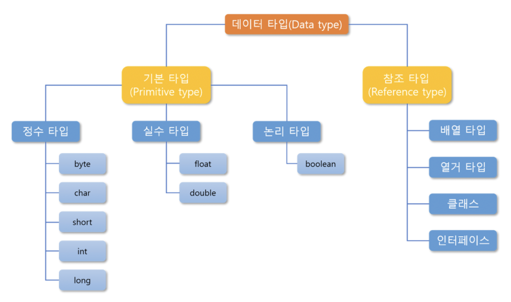
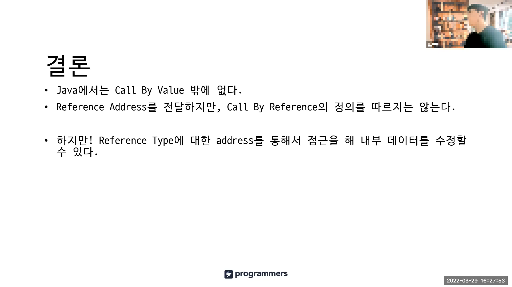

### 질문) Java 기본 자료형의 종류는 무엇이 있나요?

<details>
    <summary>답변</summary>

- 정수형 : byte, short, int, long (aka. bsil)
- 실수형 : float, double (aka. fd)
- 그 외 : boolean


</details>

#### 꼬리질문1) byte 자료형은 왜 -128~127 범위를 가지는지 아시나요?

<details>
    <summary>답변</summary>

- 1byte 는 8bit
- 컴퓨터의 최소 단위 bit는 0, 1 2진수 값을 저장 가능
- 그런데, 자바의 정수형 기본 자료형은 모두 signed 타입
- 가장 첫 번째 비트는 부호를 나타내는 비트.
- 따라서 1000_0000 ~ 0111_111 &rarr; -128~127

</details>

#### 꼬리질문2) 그럼 Java에는 unsigned 타입의 자료형에는 무엇이 있나요?

<details>
    <summary>답변</summary>

- char
- 참고 링크 : [is-java-char-signed-or-unsigned-for-arithmetic](https://stackoverflow.com/questions/54924058/is-java-char-signed-or-unsigned-for-arithmetic)

</details>

#### 꼬리질문3) float 이나 double 자료형은 돈을 위한 값을 저장하기에는 부적절해요. 왜 부적절하고 대안은 무엇이 있을까요?

<details>
    <summary>답변</summary>

- BigDecimal
- 참고 링크 : [@new_wisdom/Java-BigDecimal](https://velog.io/@new_wisdom/Java-BigDecimal과-함께하는-아마찌의-너드짓)

</details>

#### 꼬리질문4) new 연산자로 객체를 생성하는 것과 valueOf()메서드로 객체를 생성하는 방법의 차이점이 있을까요?

<details>
    <summary>답변</summary>

- contents

</details>

---
</br>

### 질문) pass by value, pass by reference 에 대해 설명해주세요.

<details>
    <summary>답변</summary>
</br>

두 방식 모두 메서드를 호출할 때, 파라미터를 통해 값을 전달하는 방식.

- pass by value : 복사된 값만 전달되는 방식으로, 기본 자료형은 항상 이에 해당된다.
- pass by reference : 객체에 대한 참조가 전달되는 방식

- 그러나, Java는 모든 메서드 호출에 있어 pass by value 방식을 사용하고 있습니다.

- 참고 링크 : [Pass By Value, Pass by Reference
-항해일지:티스토리](https://internet-craft.tistory.com/2)
- 참고 링크 : [call by value vs call by reference - 유도진 | 백엔드 데브코스 2기 | 백둥이Deview 220329
](https://youtu.be/34RAc5gdl54?si=J_yTUzFxmtjXrbXG)


</details>

#### 꼬리질문1) Java는 왜 pass by value 만 존재하나요?

<details>
    <summary>답변</summary>

- 기본 자료형이 아닌 자료형의 경우, 주소 값을 복사하기 때문.
- 참고 링크 : [JAVA) 자바에서는 Call By Reference가 불가능 합니다.](https://shanepark.tistory.com/380)
- 참고 링크 : [Java는 Call by reference가 없다](https://deveric.tistory.com/92)

</details>

#### 꼬리질문2) String은 Primitive type(기본 자료형)이 아님에도 pass by value 방식을 따르고 있습니다. 어떤 특징 때문일까요?

<details>
    <summary>답변</summary>

- String pool을 통해 immutable로 관리되기 때문

</details>


---
</br>

### 질문) "java.lang.Object" 클래스에 대해서 아는 내용을 설명해주세요.

<details>
    <summary>답변</summary>

- 모든 클래스의 최상위 클래스 이다.
- 묵시적으로 Object 클래스를 상속받고 있다.
- Object 클래스 상속을 통해 모든 클래스의 기본적인 행동을 정의할 수 있다.

</details>

#### 꼬리질문1) Object 클래스에는 어떤 메서드가 정의되어 있나요?

<details>
    <summary>답변</summary>

- 객체 처리 메서드 :
    - `public String toString()` : 객체를 문자열로 표현. println() 메서드에 매개변수로 객체가 들어갈 경우와 객체에 `+` 연산을 수행할 경우 자동으로 `toString()` 메서드가 호출된다.
    - `public boolean equals(Object obj)`
    - hasCode()
- 쓰레드 관련 메서드 : 

</details>

#### 꼬리질문2) 등위연산자`==`, equals(), hashCode() 차이점은 무엇인가요?

<details>
    <summary>답변</summary>

- 등위 연산자 : 기본자료형을 비교할 땐 값을, 참조자료형을 비교할 땐 주소값을 비교하게 된다. &rarr; 그럼 결국 stack에 저장된 값을 비교한다는거 아닌가?
- equlas() : hasCode() 메서드를 호출하여 값을 비교한다.
- hasCode() : 객체의 주소값을 반환한다.

</details>

#### 꼬리질문3) equals() 메서드 오버라이딩이 필요한 경우와 불필요한 경우를 알고 있으신가요?

<details>
    <summary>답변</summary>

- 동일한 객체간의 (멤버변수 등) 상태 비교가 필요한 경우 오버라이딩이 필요.
- 비교를 제외한 기능위주의 클래스인 경우 오버라이딩 불필요.
    - 메서드만 있는 클래스인 경우 유틸 클래스이다. static 하게 필요한 상태를 관리하는 것이 좋다.

</details>

#### 꼬리질문) equals 메서드를 재정의 할 때 주의할 점을 알고 있나요?

<details>
    <summary>답변</summary>

- 자신과 비교할 땐 true (반사성), hasCode도 같이 재정의 해야한다.
- 그렇지 않은 경우 hash를 활용하는 자료구조에서 문제가 발생한다. 왜?
```java
@Getter
@Setter
public class SampleDto {

    public String name;

    @Override
    public boolean equals(Object o) {
        SampleDto sampleDto = (SampleDto) o;
        return Objects.equals(getName(), sampleDto.getName());
    }

    @Override
    public int hashCode() {
        return 1;
    }

}
```
```java
public class HashmapSample {
    public static void main(String[] args) {

        SampleDto aaa = new SampleDto();
        aaa.setName("c");

        SampleDto bbb = new SampleDto();
        bbb.setName("c");


        HashMap<SampleDto, String> map = new HashMap<>();
        map.put(aaa, "aaa");
        map.put(bbb, "bbb");

        for (int i = 0; i < 100; i++) {
            String result = map.get(aaa);
            System.out.println("result = " + result);
        }
    }
}
```
→ 서로 다른 객체 임에도 hashCode가 같으면서 equlas() 메소드에서 실제 메모리 주소를 비교하지 않으면, Map에서 의도한 value 를 올바르게 찾지 못한다.
+) 나중에 put한 객체를 버킷에 찾아서 반환하는가?

결론 : equals () 오버라이딩을 잘 해놓자~

</details>

#### 꼬리질문4) "hashCode" 를 잘못 오버라이딩하면 "HashMap" 등 hash 콜렉션의 성능이 떨어질 수가 있습니다. 어떤 케이스일 때 그럴 수 있을까요?

<details>
    <summary>답변</summary>

- 내용

</details>

#### 꼬리질문5) "HashMap"은 내부적으로 어떻게 구현되어있길래 그렇게 빨리 값을 탐색할 수 있을까요?

<details>
    <summary>답변</summary>

- 내용

</details>

---
</br>


### 질문) String 클래스의 단점이 있다면 무엇일까요?

<details>
    <summary>답변</summary>

- String 클래스는 불변객체 Immutable하다.
- 따라서 하나의 객체에 변경 작업이 계속되면, 변경(재할당)마다 새로운 객체를 Heap 영역의 String Pool 이라는 공간에 저장한다.        
    - 저장되는 영역은 한계가 있다.
    - JDK 1.5 부터 컴파일 과정에서 `+` 연산의 경우 StringBuilder으로 자동변환되어 성능최적화

</details>

#### 꼬리질문) 불변이란 무엇이고 왜 String을 불변성을 띄게 설계되었을까?

<details>
    <summary>답변</summary>
</br>

1) 보안

- 참고 링크 : [Oracle Java Magazine, Why is Java making so many things immutable?](https://blogs.oracle.com/javamagazine/post/java-immutable-objects-strings-date-time-records)

</details>

#### 꼬리질문1) 불변한 String의 단점을 보완하는 방법이 있나요?

<details>
    <summary>답변</summary>

StringBuffer
StringBuilder

참고 자료
- [Java Compiler Optimization for String Concatenation](https://medium.com/javarevisited/java-compiler-optimization-for-string-concatenation-7f5237e5e6ed)
- [jdk1.5에서 String 더하기의 컴파일시의 최적화](https://gist.github.com/benelog/b81b4434fb8f2220cd0e900be1634753)
- [String은 항상 StringBuilder로 변환될까?](https://siyoon210.tistory.com/160)

</details>

#### 꼬리질문) String 변수에 값을 할당할 때, `new` 연산자와 쌍따옴표`""`의 차이점은?

<details>
    <summary>답변</summary>

`new`
- 매번 heap 영역에 재생성

`""`
- 힙 영역 상수풀에서 재사용하여 불필요한 재생성 비용 X

</details>

#### 꼬리질문2) String은 참조자료형임에도 불구하고, 동일한 값을 갖는 두 객체(변수)에 `==` 연산의 결과가 True 입니다. 그 이유는 무엇일까요?

<details>
    <summary>답변</summary>

- equals()를 재정의해 주소 값이 아닌, 값을 비교하도록 구현되었기 때문
- Constant Pool
- 참고 링크 : [Java String Pool](https://junhyunny.github.io/java/java-string-pool/)


</details>

#### 꼬리질문) String tokenizer와 split의 차이

<details>
    <summary>답변</summary>

- split : 분리의 기준이 되는 대상이 포함되지 않는다.
- tokenizer : 포함된다.

참고링크 : [https://velog.io/@junho5336/String.split의-limit](https://velog.io/@junho5336/String.split%EC%9D%98-limit)

</details>

---
</br>